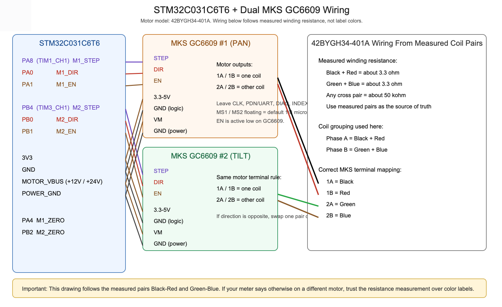

# STM32C031 PTZ Dual-Motor Demo (GC6609 / DM556 / A4988)

一个面向 `STM32C031C6 + STEP/DIR` 双轴开环云台的轻量 demo，当前版本已按调研报告做过一轮重构，并支持在运行时切换 `GC6609`、`DM556` 与 `A4988` 驱动器配置。核心目标是：

1. 双路电机按指定速度正/反转；
2. 固件侧支持速度斜坡、固件侧点动、结构化状态帧和诊断命令；
3. GUI 侧支持连接管理、双电机独立配置、实时状态/故障显示和引脚探测。
4. 固件与 GUI 侧支持每轴独立切换 `GC6609` / `DM556` / `A4988` 驱动器配置。

## 当前选型结论（2026-03-10）

基于最新实测，`MKS GC6609 StepStick + 42BYGH34-401A` 不再建议作为当前 demo 的默认落地方案。新的推荐是：

1. `首选演示方案`：保留当前 `STM32C031C6 + USB VCP + GUI + 串口协议`，把驱动器替换为已验证可带动该电机的外置 `STEP/DIR` 高余量驱动器。
2. `中期集成方案`：切到 `TMC2209 + UART 诊断 + INA219/IWDG` 架构，再补驱动诊断与保护。

完整说明见：[方案选型更新（2026-03-10）](docs/solution_selection_20260310.md)

如果后续切换到外置 `DM556` 驱动器做测试，接线和代码调整说明见：

- [STM32C031C6 对接 DM556 外置驱动器调整说明](docs/dm556_adaptation_guide.md)
- [DM556 + ULN2803A 双轴接线图 PNG](docs/stm32c031c6_uln2803a_dm556_wiring.png)

如果后续切换到 `A4988 / DRV8825` 扩展板方案，说明见：

- [STM32C031C6 对接 A4988 扩展板调整说明](docs/a4988_adaptation_guide.md)
- [A4988 双轴接线图 PNG](docs/stm32c031c6_a4988_wiring.png)

## 目录

- `Core/Src/main.c`: 主循环调度、外设初始化、0 位中断
- `Core/Src/ptz_motor.c`: 电机状态机、速度斜坡、固件侧点动、引脚探测切换
- `Core/Src/ui_uart.c`: 结构化串口协议、状态/诊断帧输出、命令解析

## 默认硬件接口（可改）

在 `Core/Inc/main.h` 中定义了默认引脚：

- M1: `DIR=PA0`, `EN=PA1`, `STEP=PA8(TIM1_CH1)`, `ZERO=PA4`
- M2: `DIR=PB0`, `EN=PB1`, `STEP=PB4(TIM3_CH1)`, `ZERO=PB2`
- UART: `USART2 TX=PA2`, `RX=PA3`（NUCLEO 默认 VCP）, 115200-8-N-1

> 注意：不同 STM32C031 封装/板卡的 AF 复用可能不同，需按你的原理图调整 `main.h` 和 `MX_GPIO_Init()`。

## STM32C031C6T6 与 MKS GC6609 接线图（双路）



### 1) 控制信号（必须连接）

| 功能 | MCU (电机1) | MKS GC6609 #1 | MCU (电机2) | MKS GC6609 #2 | 备注 |
|---|---|---|---|---|---|
| STEP | `PA8 (TIM1_CH1)` | `STEP` | `PB4 (TIM3_CH1)` | `STEP` | 上升沿计步 |
| DIR | `PA0` | `DIR` | `PB0` | `DIR` | 方向控制 |
| ENABLE | `PA1` | `EN` | `PB1` | `EN` | `高=关断, 低=使能` |

> 上表和下文中的 `STEP / DIR / EN / VM / 3.3-5V / GND / 1A / 1B / 2A / 2B`，都是 **MKS GC6609 模块板丝印**，不是裸芯片 QFN 管脚名。

### 2) 电源/配置脚（每颗 MKS GC6609 模块）

| MKS 模块针脚 | 连接建议 | 说明 |
|---|---|---|
| `3.3-5V` | `MCU 3V3` | 逻辑电源，必须接 |
| `GND` | `MCU GND` | 逻辑地，必须和 MCU 共地 |
| `VM` | `电机电源 +12V/+24V` | 功率供电 |
| `GND` | `电机电源负极` | 功率地，必须和 MCU 地共地 |
| `MS1` / `MS2` | 当前硬件已上拉到高电平 | `11` 对应 `1/16` 细分，软件换算按 `3200 steps/rev` |
| `CLK` | 不接 | 使用内部时钟 |
| `PDN/UART` | 不接 | 本 demo 不使用驱动 UART 配置 |
| `DIAG` / `INDEX` / `VREF` | 非必须 | 调试可选 |

### 3) 电机绕组连接（每颗 MKS GC6609 模块）

Makerbase 官方 `MKS GC6609 V1.0` 模块是 StepStick 兼容排针，电机输出丝印为：

| MKS 电机端子 | 说明 |
|---|---|
| `1A` + `1B` | 一组线圈 |
| `2A` + `2B` | 另一组线圈 |

根据你对这颗测试电机 `42BYGH34-401A` 的实测结果，在**电机与驱动断开**的前提下：

- 黑色 + 红色：约 `3.3 ohm`
- 绿色 + 蓝色：约 `3.3 ohm`
- 其余任意组合：约 `50 kohm`

对 4 线两相步进电机，这种测量结果应优先于外壳标签或商品页描述。也就是说，这颗电机的真实线圈分组应按下面处理：

- 黑色 + 红色：A 相
- 绿色 + 蓝色：B 相

因此在 **MKS 模块丝印** 下，建议接法应为：

| MKS 模块端子 | 建议先接到的电机线 |
|---|---|
| `1A` | 黑线 |
| `1B` | 红线 |
| `2A` | 绿线 |
| `2B` | 蓝线 |

> 说明：
> - 这颗电机的外壳标签与实测结果存在冲突，应以实测电阻分组为准；
> - `黑-红` 必须落在同一组端子 `1A/1B` 或 `2A/2B` 上，不能跨组接成 `1A+2A`；
> - `绿-蓝` 同理，也必须落在另一组端子上；
> - 若方向与 GUI/命令定义相反，只对调同一相内两根线即可，例如 `黑<->红` 或 `绿<->蓝`。

### 4) ASCII 接线图（双路）

```text
STM32C031C6T6                          MKS GC6609 #1 (PAN)
----------------------------           ---------------------------
PA8  (TIM1_CH1 / M1_STEP) -----------> STEP
PA0  (M1_DIR) -----------------------> DIR
PA1  (M1_EN) ------------------------> EN
3V3 ---------------------------------> 3.3-5V
GND ---------------------------------> GND
MOTOR_VBUS (+12V/+24V) --------------> VM
GND ---------------------------------> GND
Black -------------------------------> 1A
Red ---------------------------------> 1B
Green -------------------------------> 2A
Blue --------------------------------> 2B

STM32C031C6T6                          MKS GC6609 #2 (TILT)
----------------------------           ---------------------------
PB4  (TIM3_CH1 / M2_STEP) -----------> STEP
PB0  (M2_DIR) -----------------------> DIR
PB1  (M2_EN) ------------------------> EN
3V3/GND/VM/GND 连接方式与 #1 相同
电机线色的对应关系也与 #1 相同

0位输入:
PA4  <----------- Zero_SW1 (下拉触发, MCU内部上拉)
PB2  <----------- Zero_SW2 (下拉触发, MCU内部上拉)
```

## 编译与镜像输出（已支持 STM32C031C6T6）

- 若本机没有 `arm-none-eabi-gcc`，可先安装 xPack 工具链：
  - `npm install -g xpm`
  - `xpm install --global @xpack-dev-tools/arm-none-eabi-gcc@latest`
- 构建命令：`make -j4`
- 输出文件：
  - `build/ptz_demo_c031c6.elf`
  - `build/ptz_demo_c031c6.hex`
  - `build/ptz_demo_c031c6.bin`
- 目标芯片与链接脚本：`STM32C031C6TX_FLASH.ld`（32KB Flash）

## ST-LINK 烧录

- 命令：`make flash`
- `make flash` 会自动优先调用 `STM32_Programmer_CLI`，若不存在则尝试 `st-flash`
- 若本机都没有，会自动回退到 `openocd`（已验证支持 `STM32C031C6 + ST-LINK SWD`）

### 已安装的烧录工具（当前机器）

- `openocd`：`/opt/homebrew/bin/openocd`
- 版本：`0.12.0`（xPack 发行版）

## 图形化串口界面（桌面）

- 启动：`python3 tools/ptz_gui.py`
- 当前 GUI 结构按“连接区 + 运行模式区 + 系统状态区 + 双电机卡片 + 协议日志区”重排
- 当前桌面布局已按 `pachterlab/pegasus` 的操作台思路重构为：上方连接状态、左侧全局动作、中间双轴卡片、右侧会话监视与日志
- 每路电机卡片包含：
  - 明确区分的 `M1 / PAN`、`M2 / TILT`
  - 驱动器选择：`GC6609` / `DM556` / `A4988`
  - `Steps/rev` 与 `Wakeup(us)` 运行时配置
  - 速度设定（`rpm`）
  - 加速度设定（`rpm/s`）
  - 连续旋转 / 固件侧点动 / `Pulse Repeat` 连续点动
  - 运行状态、方向、目标/实际转速、0 位、故障、Pin Override
  - `Group Select` 联动色块与分组动作状态
  - `DIR/EN/STEP` 引脚高低电平测试与恢复
- 右侧新增简化版实时趋势区，用于查看两路 `rpm` 曲线以及 `state/fault` 变化
- GUI 与固件新协议对齐，优先解析：
  - `BUILD fw=... time=...`
  - `STAT ...`
  - `DIAG ...`
  - `OK ...`
  - `ERR ...`

## 驱动器切换

- 当前支持三套运行时驱动配置：
  - `GC6609`
  - `DM556`
  - `A4988`
- 切换粒度是“每轴独立”：
  - `M1` 可单独选 `GC6609`、`DM556` 或 `A4988`
  - `M2` 也可单独选 `GC6609`、`DM556` 或 `A4988`
- 当前运行时 profile 已预留这些配置位：
  - `EN` 有效电平
  - `DIR` 默认正反向电平
  - `STEP/DIR/EN` 建立延时
  - `steps_per_rev` 换算参数
  - `wakeup_delay_us` 起转前等待参数
- 目前项目里实际启用的 profile 差异主要是：
  - `STEP/DIR/EN` 建立延时
  - `steps_per_rev` 换算参数槽位
  - `wakeup_delay_us`
- GUI 侧切换后会立即下发对应串口命令，并按该轴当前驱动配置做 `rpm <-> Hz`、`rpm/s <-> Hz/s` 换算。
- `A4988` 额外支持运行时：
  - `cfg microstep 1|2|4|8|16`
  - `cfg steps <steps_rev>`
  - `cfg wakeup <us>`
- 固件默认上电配置为 `A4988`；如果当前硬件实际接的是 `GC6609` 或 `DM556`，上电后需先在 GUI 或串口里切过去。

## MKS GC6609 接线建议

- `STEP` -> 模块 `STEP`
- `DIR`  -> 模块 `DIR`
- `EN`   -> 模块 `EN`
- `3V3`  -> 模块 `3.3-5V`
- `GND`  -> 模块逻辑地 `GND`
- `12V`  -> 模块 `VM`
- `12V GND` -> 模块电源地 `GND`
- 0 位开关建议上拉输入、触发下拉到 GND（本 demo 默认低电平触发）
- 如果你只接了 `12V + VM/GND`，但没接 `3.3-5V + 逻辑 GND`，模块不会响应 MCU 控制
- 如果线圈被接成 `1A+2A` 或 `1B+2B` 这种跨组方式，电机通常会不转或只抖动

如果你的驱动使能/方向电平逻辑相反，改 `Core/Inc/ptz_motor.h` 中这些宏：

- `PTZ_MOTOR_EN_ACTIVE_LEVEL`
- `PTZ_MOTOR_DIR_FWD_LEVEL`
- `PTZ_MOTOR_DIR_REV_LEVEL`
- `PTZ_MOTOR_ZERO_ACTIVE_LEVEL`

## 与 GC6609 规格书对齐的关键点

- `STEP` 在上升沿计步（本 demo 用 PWM 方波，按上升沿频率作为步进速度）。
- `ENABLE` 高电平关断输出、低电平使能（本 demo 默认低有效）。
- `MS1/MS2` 芯片内部下拉，悬空默认 `00`，即 `1/8` 细分。
- 当前这套实际硬件把 `MS1=1`、`MS2=1` 固定拉高，因此 `GC6609` profile 已按 `1/16` 细分处理，即 `3200 steps/rev`。
- `HOLDEN` 低有效，默认可进入静止省电模式（规格书描述约 400ms 后降保持电流）。

## 固件控制模型

- 电机控制不再是“收到串口命令就直接改 PWM”。
- 当前固件按这条链路工作：
  - 串口协议层：解析命令、输出 `OK/ERR/STAT/DIAG/BUILD`
  - 电机状态机：`IDLE / RAMP_UP / RUN / RAMP_DOWN / PIN_TEST / FAULT`
  - 运动控制层：按加速度斜坡把 `target_hz` 平滑逼近 `actual_hz`
  - 诊断层：维护 `fault`、`pin_override`、`zero_edges`、`last_zero_tick`
- 当前默认加速度：`1600 Hz/s`，可通过命令或 GUI 单独配置每路电机
- 驱动器配置是每轴运行时属性，不再依赖重新编译固件切换

## 速度与加速度说明

- 固件底层速度单位仍是 `STEP 脉冲频率(Hz)`。
- GUI 上显示和输入使用：
  - 速度：`rpm`
  - 加速度：`rpm/s`
- `Pulse Repeat` 模式下，GUI 会按 `Pulse rate` 参数周期性发送 `jog` 命令。
- `Pulse rate` 当前支持 `0.2 .. 10.0 Hz`。
- 单次点动时长仍由 `Jog time` 决定，但 GUI 会自动限制它不能大于当前周期，避免点动命令互相重叠。
- 为兼容部分 macOS 老 Tk 环境，`Jog time` 和 `Pulse rate` 在 GUI 中采用按钮式调节，不依赖输入框显示。
- 固件实时状态同时保留：
  - `target_hz`
  - `actual_hz`
  - `rpm`
- 当前 `GC6609` 默认换算基于 `3200 steps/rev`（1.8° 电机 + `1/16` 细分，`MS1=1`、`MS2=1`）。
- 如果后面把 `GC6609` 的 `MS1/MS2` 改回别的状态，可直接用 `m1 cfg steps <steps_rev>` / `m2 cfg steps <steps_rev>` 调整逻辑换算。
- 当前默认值：
  - 连续运行速度：`10 rpm`
  - 加速度：约 `60 rpm/s`（对应 `1600 Hz/s`）

## 串口命令

- 通用命令
  - `help`
  - `version` / `ver`
  - `status`
  - `telemetry on`
  - `telemetry off`
  - `all stop`
- 每轴运行命令
  - `m1 f 1200`
  - `m1 r 800`
  - `m1 stop`
  - `m1 jog f 267 300`
  - `m1 cfg accel 1600`
  - `m1 cfg driver gc6609`
  - `m1 cfg driver dm556`
  - `m1 cfg driver a4988`
  - `m1 cfg steps 3200`
  - `m1 cfg microstep 16`
  - `m1 cfg wakeup 1000`
  - `m1 diag`
  - `m1 clear`
  - `m2 ...` 同理
- 每轴引脚探测
  - `m1 pin dir hi/lo`
  - `m1 pin en hi/lo`
  - `m1 pin step hi/lo`
  - `m1 pin restore`
  - `m2 ...` 同理

> 说明：
> - `pin test` 会把该轴切到 `PIN_TEST` 状态，并停止正常 PWM 输出；
> - `jog` 在固件内计时，不依赖 GUI 的本地定时器；
> - `cfg accel` 单位是 `Hz/s`；
> - `cfg driver` 会先停该轴，再切换驱动配置；
> - `clear` 仅清除故障锁存，不会自动重新启动电机。

程序默认会周期性输出结构化状态帧，例如：

```text
STAT tick=1234 telemetry=1 m1_state=RUN m1_dir=FWD m1_target_hz=267 m1_actual_hz=240 m1_rpm=9 m1_zero=0 m1_edges=3 m1_accel_hzps=1600 m1_fault=NONE m1_override=0 m2_state=IDLE m2_dir=STOP m2_target_hz=0 m2_actual_hz=0 m2_rpm=0 m2_zero=1 m2_edges=4 m2_accel_hzps=1600 m2_fault=NONE m2_override=0
```

常见协议返回：

```text
BUILD fw=ptz_demo_c031c6 time=2026-03-10T18:25:10+0800
OK motor=M1 action=run dir=FWD target_hz=267
DIAG motor=M1 state=RUN dir=FWD target_hz=267 actual_hz=240 rpm=9 accel_hzps=1600 zero=0 zero_edges=3 last_zero_ms=901 jog_until_ms=0 fault=NONE override=0
ERR code=BUSY detail=pin_override_active
```

## 移植步骤

1. 在 CubeMX 里创建 STM32C031 工程并启用 `GPIO + TIM1 PWM + TIM3 PWM + USART2 + EXTI`；
2. 将本目录下 `Core/Inc/*.h` 和 `Core/Src/*.c` 覆盖/拷入工程；
3. 根据你的板卡修改 `main.h` 与 `MX_GPIO_Init()` 的 AF 引脚；
4. 编译下载，串口打开 115200 即可测试。

## 0 位信号行为

- 0 位信号用于“回零/原点判定”，实时状态中显示为 `zero=0/1`；
- 触发 0 位信号时不会自动停机，也不会阻止新的运动命令；
- 如需“遇 0 位自动停机回零”的策略，可在上层控制中按 `zero` 状态执行。
