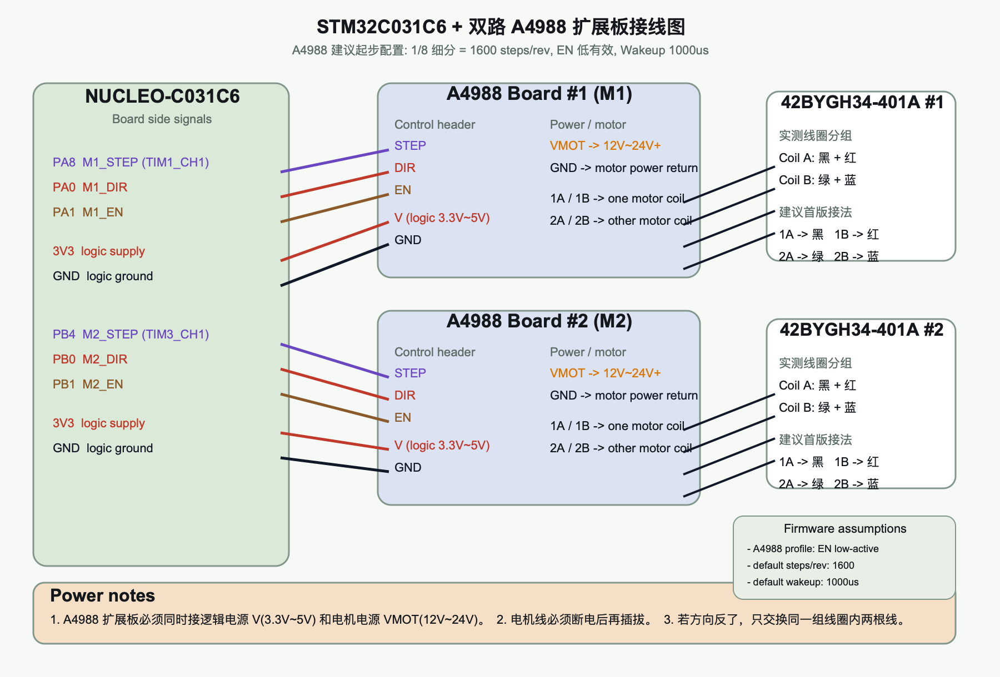

# STM32C031C6 对接 A4988 扩展板调整说明

这块附件里的板子不是一体式驱动器，而是 `A4988 / DRV8825` 插拔扩展板。根据商品 PDF 抽取内容，关键约束是：

- 数字接口：`方向 / 使能 / 速度`
- 逻辑电压：`3.3V ~ 5V`
- 电机供电：`12V ~ 30V`
- 板上拨动开关用于设置细分
- 板上 `V` 排针还需要单独给控制部分供电，否则只接电机电源不会工作

对当前项目的含义是：

1. MCU 到驱动板仍按 `STEP / DIR / EN` 工作，不需要重写底层脉冲发生逻辑。
2. 默认兼容配置按 `1/8` 细分处理，即 `1600 steps/rev`。
3. 当前固件和 GUI 已补上运行时 `steps/rev`、`microstep` 和 `wakeup_us` 配置，不再强依赖固定 `1/8` 细分。

## 当前建议接线

### 控制接口

- `PA8 / PB4` -> `STEP`
- `PA0 / PB0` -> `DIR`
- `PA1 / PB1` -> `EN`
- `MCU 3V3` -> 扩展板 `V`
- `MCU GND` -> 扩展板 `GND`

### 功率接口

- `12V ~ 24V` -> 扩展板电机电源输入
- 电机四线 -> A4988 模块输出端
- 这颗测试电机按实测线圈分组：
  - `黑 + 红` 一组
  - `绿 + 蓝` 一组
- 建议首版接法：
  - `1A -> 黑`
  - `1B -> 红`
  - `2A -> 绿`
  - `2B -> 蓝`

## 当前 runtime profile

固件里的 `A4988` profile 当前按下面假设实现：

- `EN` 低有效
- `DIR` 高=Forward, 低=Reverse
- 默认 `steps_per_rev = 1600`
- 默认 `wakeup_us = 1000`
- `STEP/DIR/EN` 建立延时比 `GC6609` 更短

## 新增运行时配置

当前协议新增：

- `m1 cfg steps 3200`
- `m1 cfg microstep 16`
- `m1 cfg wakeup 1000`

说明：

- `cfg steps`：直接设置该轴的逻辑 `steps/rev`
- `cfg microstep`：仅在当前驱动 profile 为 `A4988` 时有效，按 `200 * microstep` 自动换算 `steps/rev`
- `cfg wakeup`：设置该轴第一次起转前的额外等待时间，单位 `us`

## GUI 支持

GUI 驱动器选择已经加入：

- `GC6609`
- `DM556`
- `A4988`

切到 `A4988` 后，GUI 会下发：

- `m1 cfg driver a4988`
- `m2 cfg driver a4988`

并继续按当前 profile 的 `steps/rev` 做 `rpm <-> Hz` 换算。

GUI 里每轴都新增了：

- `Steps/rev` 预设按钮：`200 / 400 / 800 / 1600 / 3200`
- `Wakeup` 调节按钮和自定义输入
